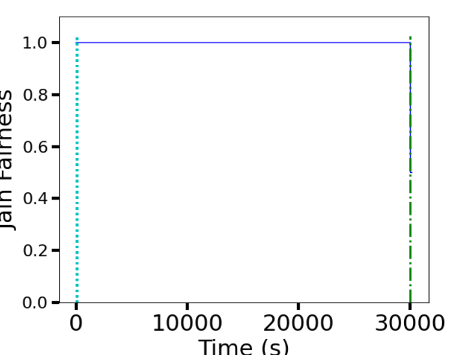
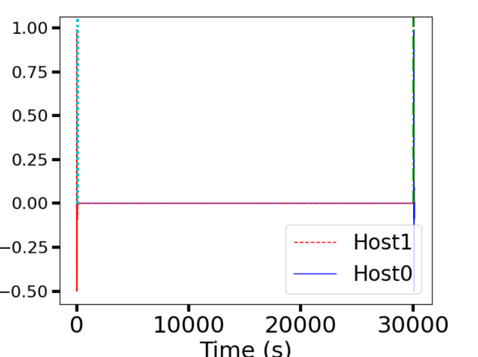
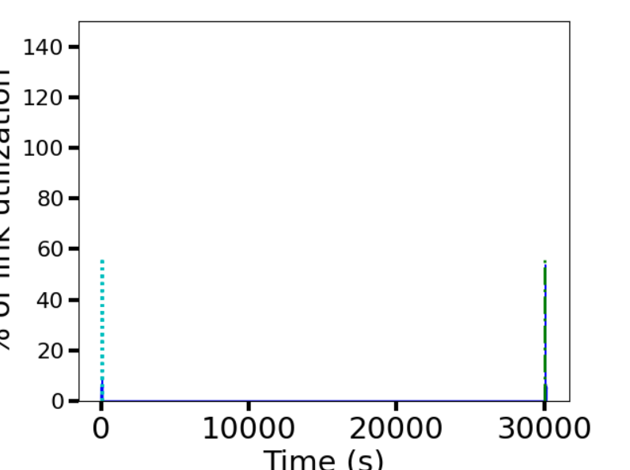

# CS305 Project Report
**12012427 黄柯睿 贡献比xx%**

**12010641 牛景萱 贡献比xx%**

**12011619 王立全 贡献比xx%**

## Data collected

### Fairness

|       |                           onelink                            |                           twolink                            |                          sharelink                           |
| :---: | :----------------------------------------------------------: | :----------------------------------------------------------: | :----------------------------------------------------------: |
| α=0.1 |  |  |  |
| α=0.5 |  |  |  |
| α=0.8 |  |  |  |

### Smoothness

|       |                           onelink                            |                           twolink                            |                          sharelink                           |
| :---: | :----------------------------------------------------------: | :----------------------------------------------------------: | :----------------------------------------------------------: |
| α=0.1 |  |  |  |
| α=0.5 |  |  |  |
| α=0.8 |  |  |  |

### Utilization

|       |                           onelink                            |                           twolink                            |                          sharelink                           |
| :---: | :----------------------------------------------------------: | :----------------------------------------------------------: | :----------------------------------------------------------: |
| α=0.1 |  |  |  |
| α=0.5 |  |  |  |
| α=0.8 |  |  |  |

## Analysis

### Different link scheme

### Different α

